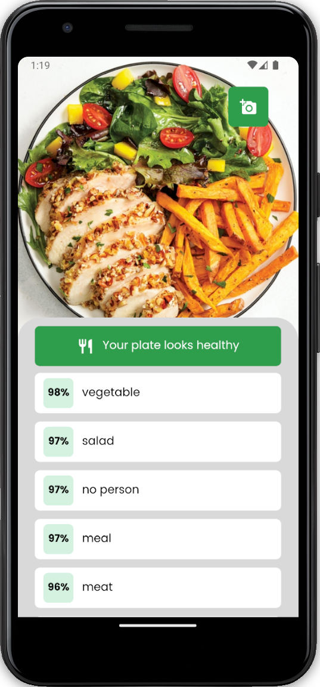

  <h1 align="center">HealthTips</h1>

  
  

## About
Eat well and stay healthy! This project was developed to help people to have a healthier life, with tips and recipes to improve their health.

## Mobile
- Expo
- React Native
- Typescript
- Axios
- Expo Google Fonts
- API Clarifai

## Run the App
- /HEALTHTIPS:
> npx expo start

## References
This project was possible thanks to `RocketSeat` community, which is a community of developers who are always looking to improve their skills and help each other.
- [RocketSeat](https://rocketseat.com.br/)
- [Clarifai AI](https://www.clarifai.com/)

## Copyright Disclaimer
Please note that this project is non-profit or not intended to be monetized.

---

<strong>Built with 💙 by [@Marcos Oliveira](https://www.linkedin.com/in/pgmarcosoliveira/)</strong>